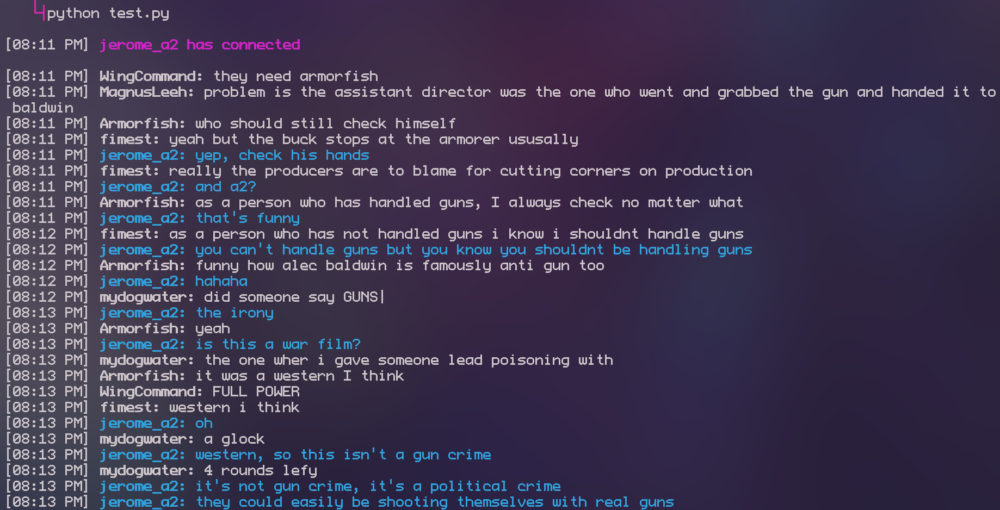

# Kongbot
## Kongregate chatbot
This script opens up a connection with Kongregate's chat websocket and uses EleutherAI to automatically generate responses to chat messages. Avoid running it on accounts that you care about, because they risk getting banned if people report you for being a chatbot.
jerome_a2 is the bot in this example:


------------
## <u>Developer</u>
[CHEFFPLAYER](https://www.kongregate.com/accounts/cheffplayer "CHEFFPLAYER")

## <u>Resources</u>
[EleutherAI](https://6b.eleuther.ai/ "EleutherAI")

[Python](https://www.python.org/ "Python")

------------
## <u>Usage</u>

```shell
pip install websocket-client
git clone https://github.com/cheffplayer/Kongbot.git
cd Kongbot/
python main.py
```

You will be prompted to for your Kongregate account details when you first run the script, but it will automatically log you in after that. If you want to change the account that the script uses, then just delete `config.py` and rerun `main.py`
The best way to tweak the way that the bot responds to messages is to edit the `chat_description` setting in `config.py`.
